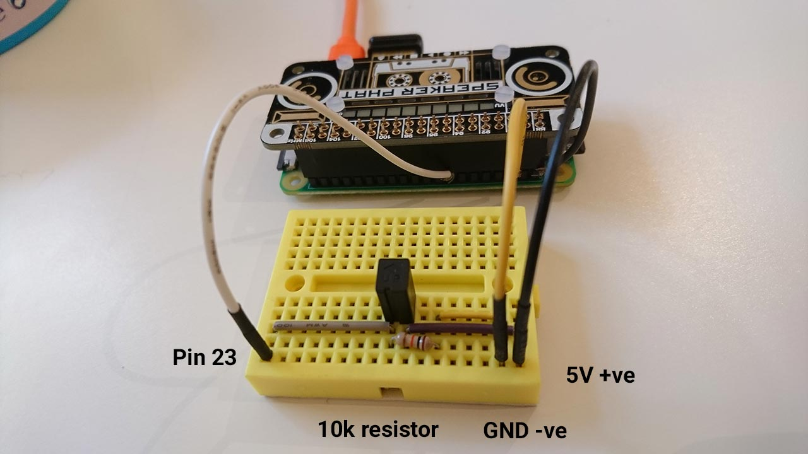

# Awkbox

A Raspberry Pi-powered soundboard that plays stupid sound clips when shaken.

## Construction

This uses a Raspberry Pi Zero and a Speaker pHAT.

* Set up the pHAT: https://learn.pimoroni.com/tutorial/sandyj/assembling-speaker-phat

* Add a sensor; this uses a tilt switch but this could easily be replaced with a button switch or similar.

  Wires were wrapped around the header pins 5V, Ground and input 23 for the switch.



## Code

* Install the software by following these instructions: https://github.com/pimoroni/speaker-phat

* Check this repo out onto the pi

* Set up the script to run on boot by editing the following file:

  ```
  sudo nano /etc/rc.local
  ```

  Add to the bottom of the file:

  ```
  # awkbox
  python /home/pi/awkbox/awkbox.py &
  ```

## Misc

Add .mp3 files to the `sfx` directory.

To adjust the volume control:

```
$ alsameter
```
